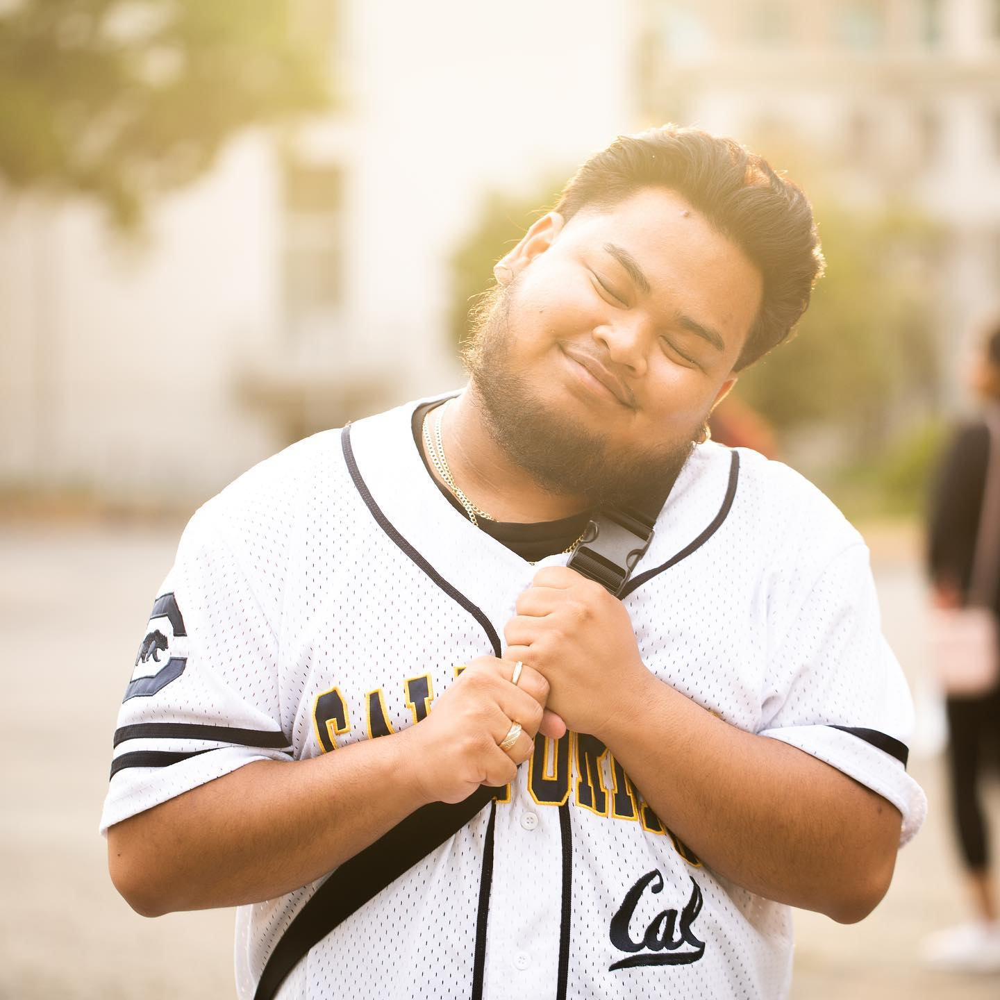

# Chris Ceguerra
## I am a culture reporter and nonfiction writer.

## Skills ##
1. Adobe Premiere
2. Adobe InDesign
3. Adobe Audition

## Previous Job Experiences
| Employer                            | Role             | Job Description       |
|-------------------------------------|------------------|---------------------- |
| The Daily Californian               |Weekender Staffer     |   <ul><li> I contribute personal essays and nonfiction pieces for the publication's online magazine, The Weekender. <li> I research trends for possible content related to student life and popular culture. </ul>|
| California Environmental Voters     |Digital Media Intern  |   <ul><li> I edit videos to produce digital content for initiatives in the non-profit. <li> I support the organization with data archival and storage of different organizational media. </ul>|
| UC Berkeley - Public Service Center | Program Assistant     |  <ul><li> As the front-of-the-office personnel, I greet guests, attend to any inquiries, and book reservations for space use. <li> I assist the office with event organization, appointed with specific roles to ensure events will progress without any inconvenience.  |
